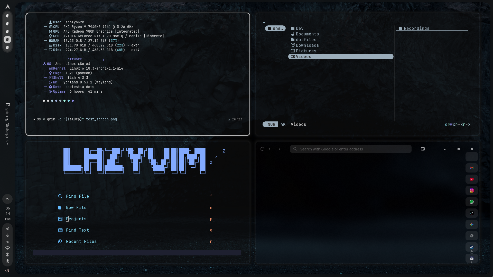

# Shalyn42k Arch Linux Hyprland dotfiles

## Мой Стек (The Stack)

Я использую следующие инструменты:

| Категория | Программа | Описание |
| :--- | :--- | :--- |
| **Window Manager** | `Hyprland` | Не все бинды настроены, эта часть то же в разработке |
| **Terminal** | `Foot` | Нынешний Foot у меня еще не настроен, так что позже добавлю натроенный |
| **Shell** | `Fish` | Fish настроен так же по ублюдошному как и Foot, copium |
| **System Info** | `Fastfetch` | Вот фастфеч работает заебата(у меня как минимум) |
| **sddm-theme** | `silent` | Тут находятся конфиги мои с sddm-silent, беки будут лежать на сервере |
| **Caelestia shell.json** | `Caelestia` | Мой кастомный shell.json + фолдер с гифками на всякий

## Планы

1. Так же п.с надо бы сделать себе скрипт по установке и правильноый распакове файлов и конфигов в нужные директории, но это патом.
2. Планирую добавить сюда еще "рецепт", своей нынешней системы на всякий, там будут все мои пакеты с pacman и yay. 
