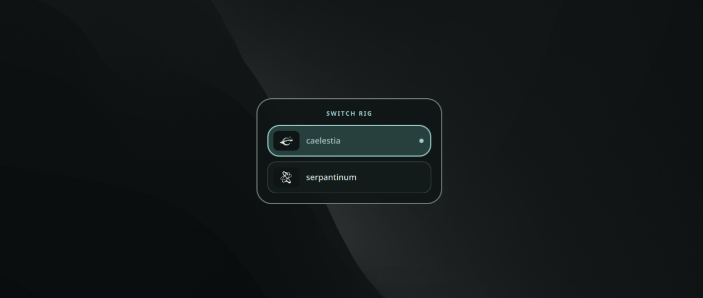

# Личные dotfiles — dual-rig Hyprland



Полные Hyprland-риги в одном репозитории с переключением между ними:

| Риг | База | Роль | Конфиг-движок | Шелл |
| :--- | :--- | :--- | :--- | :--- |
| **caelestia** | [caelestia-dots](https://github.com/caelestia-dots/caelestia) | work | lua (`hyprland.lua`) | caelestia shell (quickshell) |
| **serpantinum** | [ilyamiro/serpantinum](https://github.com/ilyamiro/serpantinum) (submodule) | third | lua (`hyprland.lua`) | serpantinumd + quickshell |

Переключение — `SUPER+SHIFT+D` (overlay-пикер). В SDDM одна запись,
«Hyprland (rig)»: она читает `profiles/active`, поэтому запоминать риг греетеру
не нужно.

Оба рига на lua-провайдере, значит свитч однодвижковый и идёт **без релогина**.
Hyprlang-ветка ушла из репозитория вместе с ригом ilyamiro (2026-09-03) — с ней
ушли ручные порты правил, анимаций и настроек WM на второй язык конфига.

> Оговорка: бинды при горячем свитче пока НЕ переключаются — стадия отключена,
> снос набора через хендлы роняет композитор. Цвета, анимации, правила окон и
> шелл переключаются. См. `docs/tech-debt.md` п.8.

## Установка с нуля

Нужно: Arch-подобная система, `git`, AUR-хелпер (`yay`/`paru`), sudo.

```bash
git clone --recurse-submodules git@github.com:shalyn42k/dotfiles.git ~/dotfiles
git clone https://github.com/shalyn42k/rigger ~/Dev/rigger   # свистелка, отдельный репозиторий
~/Dev/rigger/bin/rigswitch-install
~/dotfiles/bootstrap.sh
```

Свитчер ригов (`dotprofile`, `rigdo`, `kbm`, overlay-пикер) с 2026-09-05 живёт
в отдельном репозитории **rigger**. Эта репа держит только личное: сами риги,
общие конфиги и скрипты рабочего стола. Где лежит rigger, дотфайлы не знают —
они зовут его по стабильному пути установки `~/.config/hypr-shared/bin/`.

**Чужие dotfiles качать не надо** — репозиторий содержит полные снапшоты обоих
ригов в `profiles/`. Скрипт ничего не клонирует со стороны, он только
раскладывает то, что уже есть:

1. **Пакеты** — ставит недостающие (pacman → yay/paru): Hyprland-стек, шеллы,
   kitty/fish/fuzzel, matugen, утилиты. Список — в `PKGS` внутри скрипта.
2. **Шеллы ригов** — оба вендорятся сабмодулями `profiles/<риг>/shell`.
   caelestia ставится хуком рига `profiles/caelestia/update.sh`
   (`cmake --install` только QML, в `~/.config/quickshell/caelestia`, без sudo);
   serpantinum запускается прямо из сабмодуля через `SERPANTINUM_DIR`.
   C++-плагин caelestia — единственное, что требует sudo, и только когда
   апстрим трогает C++.
3. **Симлинки** — контестируемые каталоги `~/.config/{hypr,gtk-3.0,gtk-4.0,qt5ct,qt6ct}`
   → `profiles/active/*`, общие `~/.config/{caelestia,fish,kitty,fastfetch}` →
   `.config/*` репозитория. Живые каталоги не затираются — бэкап в
   `*.pre-bootstrap`.
4. **Matugen-шаблоны** — темы Discord/Obsidian рига в
   `~/.config/matugen/`.
5. **SDDM-сессии** — два `.desktop` в `/usr/share/wayland-sessions/`
   (с подстановкой твоего `$HOME`).
6. **Первичный рендер** — генерируемые конфиги (fastfetch) + статус.

Скрипт идемпотентен — повторный запуск ничего не ломает.

После установки:

1. Положи обои (jpg/png/mp4) в `~/Pictures/Wallpapers`.
2. Relogin через SDDM → сессия «Hyprland (rig)», риг берётся из `profiles/active`.
3. Переключение на лету: `SUPER+SHIFT+D`.

> Hyprland нужен с lua config provider (0.55+, сборка CachyOS или git) —
> caelestia живёт на `hyprland.lua`.

## Что в системе и за что отвечает

| Компонент | Зачем |
| :--- | :--- |
| `~/.config/hypr-shared/bin/dotprofile` | Ядро свитчера (репа **rigger**): переключение ригов, рендер цветов/тем |
| `~/.config/hypr-shared/bin/rigdo` | Диспетчер действий по активному ригу (репа **rigger**) |
| `bin/rig-theme` | Перерисовать GTK/Qt/kitty палитрой активного рига и заставить открытые окна перечитать CSS |
| `bin/kbd-theme-sync` | Подсветка клавиатуры (ASUS TUF) плавно уезжает в доминирующий цвет обоев активного рига |
| `bin/thunar-css-fix` | Возвращает канон `thunar.css` поверх рендера caelestia CLI (тот вшивает свои hex и ломающий панели fade-in) |
| `profiles/<rig>/` | Полный снапшот рига: hypr, gtk, qt5ct/qt6ct, `session.sh` (старт/стоп шелла), `role`, `fastfetch.modules` |
| `~/.config/hypr-shared/` | Общие бинды и контракт — симлинк в репозиторий **rigger**, ставится его `rigswitch-install` |
| `.config/gtk-shared/thunar.css` | Канон темы Thunar: один на оба рига (цвета из `@define-color` активного `gtk.css`, без hex) |
| `.config/systemd/user/` | `*.path`-юниты: следят за обоями/схемами (kbd) и за перерендером `thunar.css` |
| `.config/{fish,kitty,fastfetch,caelestia}/` | Не-контестируемые конфиги — общие для всех ригов |
| Тем-пайплайн | Рамки, Discord, Obsidian, fastfetch следуют акценту активного рига |

## Структура

```
bin/
  kbd-theme-sync  подсветка клавиатуры за цветом обоев (bootstrap линкует
  thunar-css-fix  их в ~/.local/bin — юниты зовут по этому пути)
  rig-theme       перерисовать тему рабочего стола палитрой активного рига
  rig-logs        логи шелла активного рига
  start-hyprland-profile  точка входа SDDM-сессии «Hyprland (rig)»
profiles/
  active -> caelestia|serpantinum  симлинк активного рига
  caelestia/   снапшот рига: hypr, gtk-3.0/4.0, qt5ct/qt6ct + session.sh
               + role (work) + fastfetch.modules (дата/время)
               + вендоренный шелл (submodule) + update.sh (хук пересборки)
  serpantinum/ то же + вендоренный шелл (submodule) + matugen-шаблоны
               + patches/ (правки апстрима) + role (third)
.config/
  gtk-shared/  канон thunar.css (копии в профилях — цель записи caelestia CLI,
               path-юнит откатывает их к канону; симлинками делать нельзя)
               + bookmarks.in — канон GTK-закладок на оба рига
  systemd/user/  path-юниты: kbd-theme-sync, thunar-css-fix
  caelestia/ fish/ kitty/ fastfetch/  не-контестируемые конфиги (общие)
sddm/          .desktop-файлы двух wayland-сессий
(docs/ и сам свитчер уехали в репозиторий rigger)
```

`~/.config/{hypr,gtk-3.0,gtk-4.0,qt5ct,qt6ct}` — симлинки на `profiles/active/*`,
поэтому свитч рига = перекинуть один симлинк.

### Файлы `*.in`

GTK-закладки, `qt5ct/qt6ct.conf` и `@import` в `gtk.css` требуют **абсолютный**
путь до `$HOME` — ни `~`, ни переменные окружения они не разворачивают. Хранить
там чужой `/home/<кто-то>` нельзя, а подставить `$HOME` на лету некому: каталоги
приезжают в `~/.config` целиком симлинком.

Поэтому в репо лежит `<файл>.in` с плейсхолдером `__HOME__`, а живой `<файл>`
раскрывается шагом 3 `bootstrap.sh` и сидит в `.gitignore`. Правишь `.in`,
не результат — иначе правку затрёт следующий bootstrap.

Так же устроены и личные конфиги: `.config/caelestia/shell.json` шелл
перезаписывает сам (и держит город погоды, VPN, избранные приложения), поэтому
трекается только обезличенный `shell.json.in` — и он рендерится **один раз**,
если живого файла ещё нет.

## dotprofile

```
dotprofile switch <name>   переключить риг (симлинки + цвета + анимации + шелл)
dotprofile menu            fuzzel-меню (SUPER+SHIFT+D)
dotprofile status          активный риг + состояние симлинков
dotprofile update <name>   материализовать конфиги, прогнать installer рига, снять снапшот
dotprofile colors          переприменить цвета активного рига (зовёт matugen-хук)
```

При горячем свитче runtime-командами применяются: цвета рамок и групп, анимации,
акцент fastfetch, тема Discord (Vencord) и CSS-сниппет Obsidian.

## rigdo

Бинды обоих ригов зовут `rigdo <action>` — команда выбирается по **активному** ригу
в момент нажатия, а не по тому, с чем стартовала сессия:
`launcher wallpaper settings music calendar movies clipboard screenshot lock shell battery network guide`.

## Тем-пайплайн

Один целевой файл на приложение, контент подменяется по ригу (`dotprofile colors`):

- **Discord** → `~/.config/{vesktop,equibop,Vencord}/themes/rig.theme.css`
- **Obsidian** → `<vault>/.obsidian/snippets/rig-theme.css`
- **fastfetch** → `.config/fastfetch/rig.jsonc` из `config.jsonc.template`
  (gitignored; `config.jsonc` отдан matugen'у шелла serpantinum, поэтому
  `fish_greeting` зовёт fastfetch с явным `-c`): баннер и ключи красятся
  в акцент рига, в `{{RIG_MODULES}}`
  вставляется `profiles/<rig>/fastfetch.modules`. Строка `rig` динамическая —
  читает `profiles/active` + `profiles/<rig>/role` на каждом запуске.

Вариант serpantinum генерит matugen из обоев (шаблоны в `profiles/serpantinum/matugen/`,
хук `dotprofile colors` дёргается при смене обоев); вариант caelestia — статические
файлы в `profiles/caelestia/`.

## Известные особенности

- **Конфиг-движок фиксируется при старте сессии.** Горячий свитч на «чужой» движок
  меняет шелл/цвета/анимации, но бинды и правила WM полностью применятся после relogin.
- При кросс-движковом свитче dotprofile глушит auto-reload (`misc:disable_autoreload`) —
  иначе правка файлов загруженного рига триггерит reload и ошибку `cannot open hyprland.lua`.
- `hyprctl reload` не перечитывает закешированные `require()`-модули lua — изменения
  биндов caelestia требуют relogin.
- Анимации при свитче применяются из заранее переведённых файлов
  `profiles/*/animations-runtime.{lua,keywords}` (статическая трансляция).
- `profiles/*/hypr/scripts/quickshell/calendar/.env` (API-ключ погоды) — только локально,
  в gitignore.
